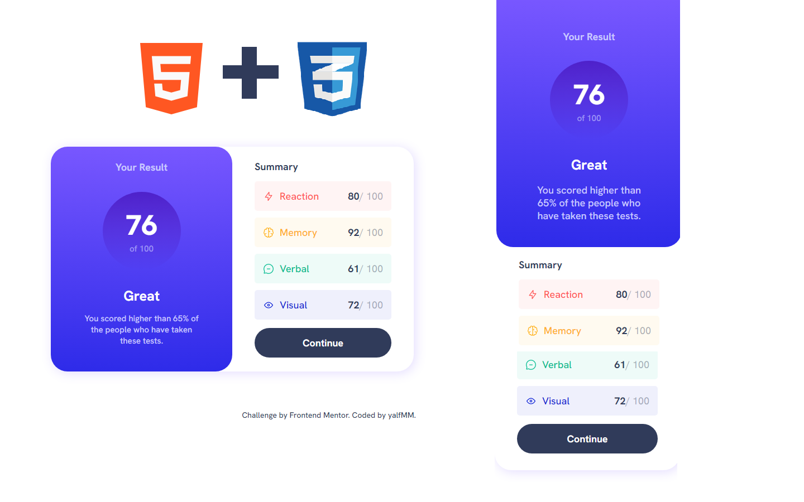

# Frontend Mentor - Results summary component

## Hello! 👋

Here is a solution to [Results summary component](https://www.frontendmentor.io/challenges/results-summary-component-CE_K6s0maV). Frontend Mentor challenges help you improve your coding skills by building realistic projects. 

### Screenshot

## Process

### What I learned

- Basic positioning in HTML and CSS

### Built with

- Semantic HTML5 markup
- CSS custom properties
- Responsive Design

## Author

- Website - [github/yalfmm](https://github.com/yalfmm)
- Frontend Mentor - [@yalfmm](https://www.frontendmentor.io/profile/yalfmm)